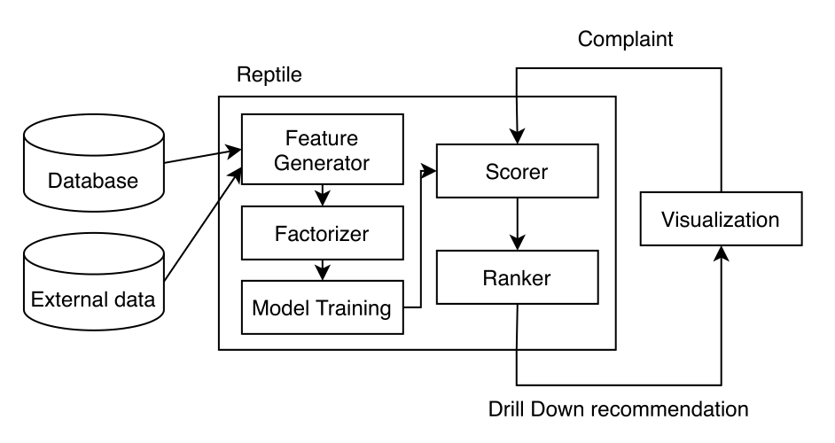

## Introduction

Traditional database cleaning and explanation systems reply primarily on the user’s complaint as the quality measure and make strong assumptions about the error types. For systems which generate explanations by perturbing input values through models, they either use very simple models or assume that user can provide magical models. This is a pain point: data scientists may have domain-specific knowledge, but asking them to provide models before using the system is impractical. 

Reptile is an innovative explanation system that guides user as they incrementally make complaint drill down into the hierarchies. Reptile leverages domain-specific knowledge and hierarchical structure to repair dataset at aggregation level and recommend next drill down. 

At the minimum, user only needs to provide the dataset and aggregation functions they want to inspect, and Reptile is all set! Reptile will work like an outlier detector to resolve user's complaints. Reptile allows users to provide small pieces of data as domain-specific knowledge, and Reptile will combine these signals to make more meaningful explanations.

## Demo

We collobarate with Columbia University Financial Instru-ments Sector Team, who is working on project to design weatherindex insurance for Ethiopia. FIST collects farmer reporteddrought severity (from 1 (low) to 10 (high)) at different villagesin different years in Ethiopia through questionnaires. The questionnaires also record farmers’ reason for each reported drought severity. Ethiopia has a geographical hierarchy: Region, District,Village. Farmer reported data have data cleaning problems which FIST hopes to discover. For example, farmers sometimes confusethe years or the events. Sensing data are available for each villageand district each year. Given the large volume of questionnaires,FIST hopes to prioritize on the questionnaires that are likely toc ontain data cleaning errors. We set up a demo page of Reptilecan to help FIST discover data cleaning problems. Click [here](http://35.232.65.156:5000/com) to see the demo.

The source codes for model training optimizations is available [here](https://github.com/zachary62/Dynamic-f-tree).
